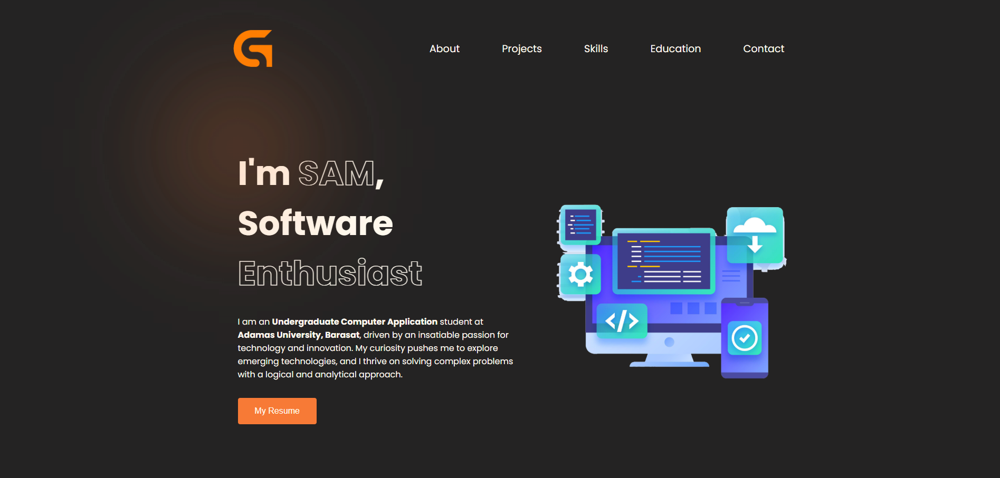
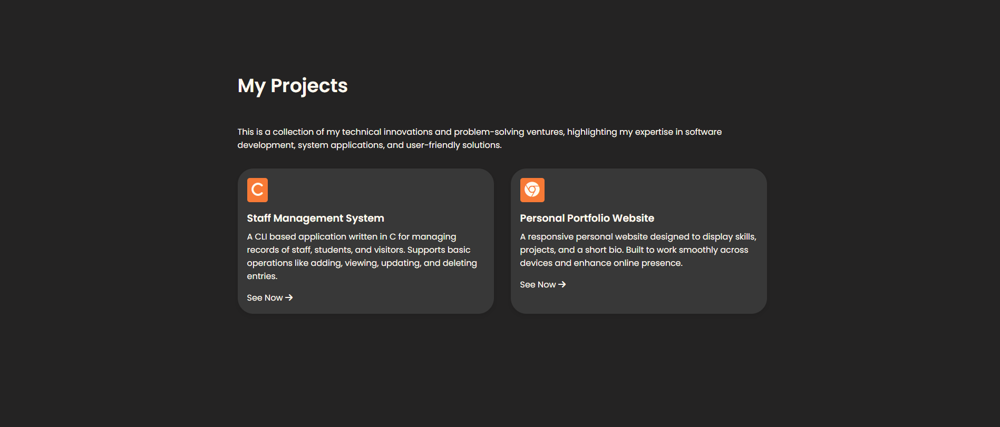
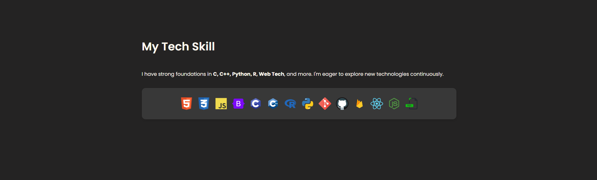
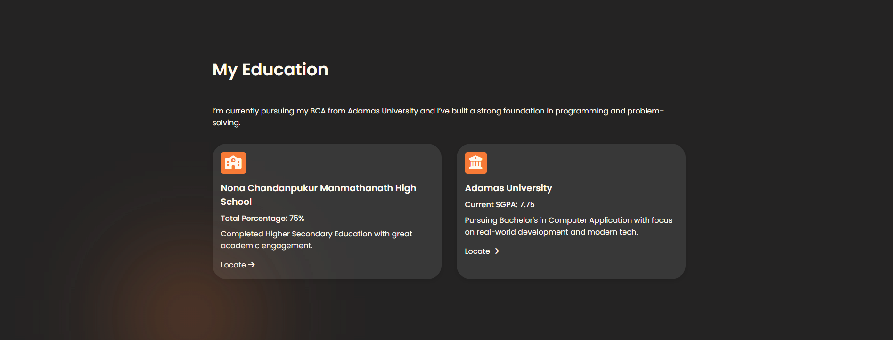

# Personal-Portfolio-Website
This is my first portfolio website creating as a school project but time by time i developed it as personal project. Here you can see a short description about me &amp; all of my Skills, Education Qualification, Certifications etc.
# Technologies Used
This is my first portfolio website so there are some optimization or styling error happened. But i tried my best and used some techs which i learn till now. I keep upskill my self and optimized it more better.
<ul>
  <li>HTML5</li>
  <li>CSS</li>
  <li>Netlify Hosting</li>
</ul>

## Hosting Link: https://soumyaghoshportfolio.netlify.app/
# Overview Image

